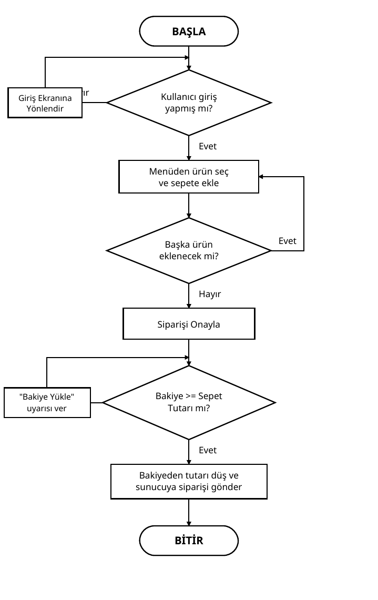

# KahveGo Mobil Kahve Sipariş Uygulaması

Bu dosya, KahveGo projesine ait akış şeması, sözde kod, REST API tasarımı ve SOLID prensip analizlerini içermektedir.

---

## GÖREV 1: Mobil Akış Şeması ve Sözde Kod

### Seçenek A: Akış Şeması (Flowchart)
> Not: Detaylı akış şeması çizimi repo içerisindeki `flowchart.png` dosyasında yer almaktadır.



### Seçenek B: Sözde Kod (Pseudocode)
```text
BAŞLA

    // 1. Kullanıcı Oturum Kontrolü
    EĞER (kullaniciGirisYapmis == YANLIŞ) İSE
        YAZDIR "Lütfen sisteme giriş yapınız."
        GirisEkraninaYonlendir()
    BİTİR_EĞER

    // 2. Ürün Seçimi ve Sepet Hazırlığı
    MenuGoster()
    sepetToplami = 0
    devamMi = "E"

    // 3. Ürün Ekleme Döngüsü
    DÖNGÜ (devamMi == "E") İKEN
        secilenUrun = UrunSec()
        sepetToplami = sepetToplami + secilenUrun.fiyat
        SepeteEkle(secilenUrun)
        
        YAZDIR "Başka ürün eklemek ister misiniz? (E/H):"
        OKU devamMi
    BİTİR_DÖNGÜ

    // 4. Sipariş Onay ve Cüzdan Bakiye Kontrolü
    YAZDIR "Sepet Tutarı: " + sepetToplami
    YAZDIR "Siparişi onaylıyor musunuz? (E/H):"
    OKU onaySecimi

    EĞER (onaySecimi == "E") İSE
        EĞER (cuzdanBakiyesi >= sepetToplami) İSE
            cuzdanBakiyesi = cuzdanBakiyesi - sepetToplami
            SunucuyaSiparisGonder(secilenUrunler, sepetToplami)
            YAZDIR "Siparişiniz onaylandı, hazırlanıyor."
        DEĞİLSE
            YAZDIR "Bakiye Yetersiz! Lütfen Bakiye Yükle işlemi yapınız."
            BakiyeYuklemeEkraninaYonlendir()
        BİTİR_EĞER
    DEĞİLSE
        YAZDIR "Sipariş iptal edildi."
    BİTİR_EĞER

BİTİR
```

---

## GÖREV 2: REST API & JSON Tasarımı

### 1. Sipariş Oluşturma:
* **HTTP Metodu:** POST
* **URL:** `/api/v1/siparisler`
* **Header:**
```http
Authorization: Bearer <token>
Content-Type: application/json
```
* **Örnek Request Body (JSON):**
```json
{
  "kahve_adi": "Latte",
  "boyut": "Orta",
  "adet": 2,
  "toplam_tutar": 130.00
}
```
* **Başarılı Sonuç HTTP Durum Kodu:** `201 Created`
* **Kullanıcı Giriş Yapmamışsa Dönecek HTTP Durum Kodu:** `401 Unauthorized`

### 2. Cüzdan Bakiye Sorgulama:
* **HTTP Metodu:** GET
* **URL:** `/api/v1/kullanici/bakiye`
* **Örnek Response (JSON):**
```json
{
  "bakiye": 185.50,
  "para_birimi": "TRY"
}
```
* **Sunucuda Beklenmeyen Hata Çıkarsa Dönecek Durum Kodu:** `500 Internal Server Error`

### Mini Mülakat Sorusu:
* **Soru:** Yukarıdaki GET ve POST isteklerinden hangisi Idempotent (Eşgüçlü) bir istektir, hangisi değildir? Neden?
* **Cevap:** GET isteği idempotent (eşgüçlü) bir istektir; çünkü aynı istek kaç kez tekrarlanırsa tekrarlansın sunucudaki kaynak üzerinde herhangi bir değişiklik yapmaz, yalnızca mevcut bakiyeyi okur. POST isteği ise idempotent değildir; çünkü bu istek her gönderildiğinde sunucuda yeni bir sipariş kaydı üretilir ve bakiyeden mükerrer olarak düşüm yapılır.

---

## GÖREV 3: Clean Code & SOLID Prensip Teşhisi

```java
class KahveSiparisYoneticisi {
    void sepetHesaplaVeIndirimUygula() { ... }
    void krediKartindanTahsilatYap() { ... }
    void siparisiVeritabaninaKaydet() { ... }
    void musteriyiSmsIleBilgilendir() { ... }

    double indirimHesapla(String musteriTipi, double tutar) {
        if (musteriTipi == "OGRENCI") return tutar * 0.80;
        else if (musteriTipi == "OGRETMEN") return tutar * 0.85;
        else return tutar;
    }
}
```

### 1. Soru & Cevap:
*Bu sınıfta Single Responsibility Principle nasıl ihlal edilmiştir? Sınıfı hangi küçük parçalara bölmeliyiz?*  
**Cevap:** Bu sınıf sepet tutarı hesaplama, ödeme tahsilatı, veritabanı kayıt ve SMS ile bilgilendirme gibi birbirinden tamamen bağımsız sorumlulukları tek başına üstlenerek birden fazla değişme sebebi barındırdığı için bu prensibi ihlal etmiştir. Sınıf; sipariş yönetimi, ödeme servisi, veritabanı erişim servisi ve bildirim servisi şeklinde ayrı sınıflara bölünmelidir.

### 2. Soru & Cevap:
*indirimHesapla fonksiyonunda yarın yeni bir müşteri tipi geldiğinde if-else kodunu değiştirmek zorunda kalmak hangi SOLID prensibine aykırıdır?*  
**Cevap:** Bu durum Open/Closed Principle kuralına aykırıdır. Bu prensibe göre bir yapı yeni gereksinimlere açık, ancak mevcut kodun değiştirilmesine kapalı olmalıdır. Yeni bir müşteri grubu geldiğinde mevcut kaynak koddaki şart bloklarını değiştirmek yerine soyutlama veya polimorfizm kullanılarak genişletme sağlanmalıdır.
